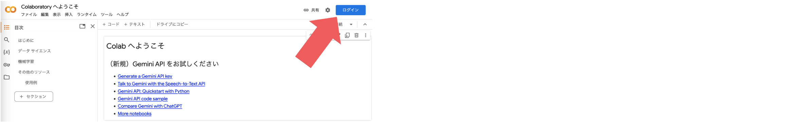
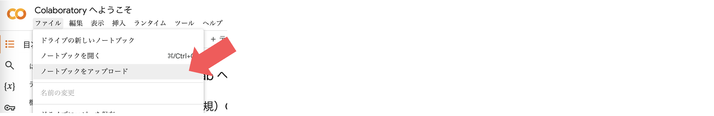
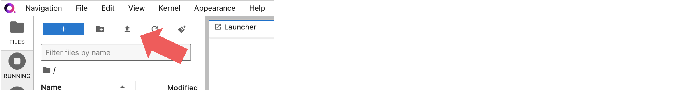

# Google Colab または qBraid Lab を使ってQiskitを実行する準備

## Google Colabの場合
(1) [Google Colab](https://colab.research.google.com)にログイン

(2) 「ファイル」→「ノートブックをアップロード」

## qBraidの場合
(1) qBraid Labにログイン

(2) [手順](ibm.biz/qbraidja)に従って環境作成

(3) 左上の上矢印マークからファイルをアップロード 

## Qiskitをインストールする場合
[こちら](https://quantum-tokyo.github.io/introduction/get_started.html)をご参照ください。